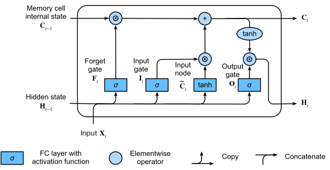

<script type="text/javascript" async
  src="https://cdnjs.cloudflare.com/ajax/libs/mathjax/2.7.7/MathJax.js?config=TeX-MML-AM_CHTML">
</script>

# LSTMs and GRUs

### Why Do We Need LSTMs and GRUs?

**RNNs:**
- RNNs (Recurrent Neural Networks) process sequential data by maintaining hidden states across time steps.


- **Problem:** They struggle with long-term dependencies due to *vanishing* and *exploding* gradients during backpropagation.

**Solution:**
- LSTMs (Long Short-Term Memory) and GRUs (Gated Recurrent Units) help to:
  - Retain relevant information for longer sequences.
  - Control what information to keep or discard.

## 2. Long Short-Term Memory (LSTM) Networks

### Key Idea
LSTMs use memory cells and three *gates* to control the flow of information:

### LSTM Structure
1. **Forget Gate:** Decides what information to discard.
   
   \[
   \mathbf{f}_t = \sigma(\mathbf{W}_f [\mathbf{h}_{t-1}, \mathbf{x}_t] + \mathbf{b}_f)
   \]
   - $\mathbf{f}_t$: Forget gate output (values between 0 and 1).
   - $\sigma$: Sigmoid activation function.
   - $\mathbf{W}_f$: Weight matrix for the forget gate.
   - $\mathbf{h}_{t-1}$: Hidden state from the previous time step.
   - $\mathbf{x}_t$: Input at the current time step.
   - $\mathbf{b}_f$: Bias vector for the forget gate.

2. **Input Gate:** Determines what new information to store.

   \[
   \mathbf{i}_t = \sigma(\mathbf{W}_i [\mathbf{h}_{t-1}, \mathbf{x}_t] + \mathbf{b}_i)
   \]
   - $\mathbf{i}_t$: Input gate output (values between 0 and 1).
   - $\mathbf{W}_i$: Weight matrix for the input gate.
   - $\mathbf{b}_i$: Bias vector for the input gate.

3. **Cell State Update:** Updates the memory cell.

   \[
   \tilde{\mathbf{C}}_t = \tanh(\mathbf{W}_c [\mathbf{h}_{t-1}, \mathbf{x}_t] + \mathbf{b}_c)
   \]
   - $\tilde{\mathbf{C}}_t$: Candidate cell state (values between -1 and 1).
   - $\tanh$: Hyperbolic tangent activation function.
   - $\mathbf{W}_c$: Weight matrix for the candidate cell state.
   - $\mathbf{b}_c$: Bias vector for the candidate cell state.

   \[
   \mathbf{C}_t = \mathbf{f}_t \odot \mathbf{C}_{t-1} + \mathbf{i}_t \odot \tilde{\mathbf{C}}_t
   \]
   - $\mathbf{C}_t$: Updated cell state.
   - $\mathbf{C}_{t-1}$: Cell state from the previous time step.
   - $\odot$: Element-wise multiplication.

4. **Output Gate:** Controls what information becomes the hidden state.

   \[
   \mathbf{o}_t = \sigma(\mathbf{W}_o [\mathbf{h}_{t-1}, \mathbf{x}_t] + \mathbf{b}_o)
   \]
   - $\mathbf{o}_t$: Output gate output (values between 0 and 1).
   - $\mathbf{W}_o$: Weight matrix for the output gate.
   - $\mathbf{b}_o$: Bias vector for the output gate.

   \[
   \mathbf{h}_t = \mathbf{o}_t \odot \tanh(\mathbf{C}_t)
   \]
   - $\mathbf{h}_t$: Hidden state at the current time step.



### Why Use LSTMs?
- They maintain long-term dependencies.
- Mitigate the vanishing gradient problem.

### Example Code (LSTM)
```python
import torch
from torch import nn

lstm = nn.LSTM(input_size=10, hidden_size=20, num_layers=1)
x = torch.randn(5, 3, 10)  # (sequence_length, batch_size, input_size)
out, (h, c) = lstm(x)
print(out.shape, h.shape, c.shape)
```

## 3. Gated Recurrent Units (GRUs)

### Key Idea
GRUs simplify the LSTM by using only two gates:

### GRU Structure
1. **Update Gate:** Controls how much of the previous information is carried forward.

   \[
   \mathbf{z}_t = \sigma(\mathbf{W}_z [\mathbf{h}_{t-1}, \mathbf{x}_t] + \mathbf{b}_z)
   \]
   - $\mathbf{z}_t$: Update gate output (values between 0 and 1).
   - $\mathbf{W}_z$: Weight matrix for the update gate.
   - $\mathbf{b}_z$: Bias vector for the update gate.

2. **Reset Gate:** Controls how much of the past information to forget.

   \[
   \mathbf{r}_t = \sigma(\mathbf{W}_r [\mathbf{h}_{t-1}, \mathbf{x}_t] + \mathbf{b}_r)
   \]
   - $\mathbf{r}_t$: Reset gate output (values between 0 and 1).
   - $\mathbf{W}_r$: Weight matrix for the reset gate.
   - $\mathbf{b}_r$: Bias vector for the reset gate.

3. **Candidate Activation:** Computes a candidate hidden state.

   \[
   \tilde{\mathbf{h}}_t = \tanh(\mathbf{W}_h [\mathbf{r}_t \odot \mathbf{h}_{t-1}, \mathbf{x}_t] + \mathbf{b}_h)
   \]
   - $\tilde{\mathbf{h}}_t$: Candidate hidden state (values between -1 and 1).
   - $\mathbf{W}_h$: Weight matrix for the candidate hidden state.
   - $\mathbf{b}_h$: Bias vector for the candidate hidden state.

4. **Final Hidden State:** Blends old and new information.

   \[
   \mathbf{h}_t = \mathbf{z}_t \odot \mathbf{h}_{t-1} + (1 - \mathbf{z}_t) \odot \tilde{\mathbf{h}}_t
   \]
   - $\mathbf{h}_t$: Hidden state at the current time step.


### Why Use GRUs?
- Simpler and faster than LSTMs (fewer parameters).
- Suitable for applications where training time is critical.

### Example Code (GRU)
```python
import torch
from torch import nn

gru = nn.GRU(input_size=10, hidden_size=20, num_layers=1)
x = torch.randn(5, 3, 10)  # (sequence_length, batch_size, input_size)
out, h = gru(x)
print(out.shape, h.shape)
```

## 4. Comparing LSTMs and GRUs

| Feature            | LSTM                         | GRU                    |
|--------------------|------------------------------|-------------------------|
| Number of Gates    | 3 (forget, input, output)    | 2 (update, reset)       |
| Complexity         | Higher (more parameters)     | Lower (faster training) |
| Performance        | Better for complex tasks     | Faster for simpler tasks|
| Use Case           | Long sequences, complex data | Faster, simpler models  |

---

<script type="text/javascript" src="https://cdnjs.cloudflare.com/ajax/libs/mathjax/2.7.7/MathJax.js?config=TeX-MML-AM_CHTML"></script>


