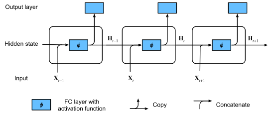
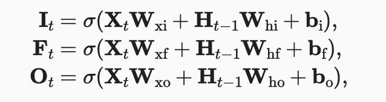

# LSTMs and GRUs

## Ref: 
- [LSTM Tutorial](https://colah.github.io/posts/2015-08-Understanding-LSTMs/)
- [D2l Chapters 10.1 and 10.2](https://d2l.ai/chapter_recurrent-modern/lstm.html)
  
### Why Do We Need LSTMs and GRUs?

**RNNs:**
- RNNs (Recurrent Neural Networks) process sequential data by maintaining hidden states across time steps.



- **Problem:** They struggle with long-term dependencies due to *vanishing* and *exploding* gradients during backpropagation.

**Solution:**
- LSTMs (Long Short-Term Memory) and GRUs (Gated Recurrent Units) help to:
  - Retain relevant information for longer sequences.
  - Control what information to keep or discard.

## 2. Long Short-Term Memory (LSTM) Networks

### Key Idea
LSTMs use memory cells and three *gates* to control the flow of information. 

### LSTM Structure



1. **Forget Gate:** Decides what information to discard.
 
   - **F<sub>t</sub>**: Forget gate output (values between 0 and 1).
   - **σ**: Sigmoid activation function.
   - **W<sub>f</sub>**: Weight matrix for the forget gate.
   - **H<sub>t-1</sub>**: Hidden state from the previous time step.
   - **X<sub>t</sub>**: Input at the current time step.
   - **b<sub>f</sub>**: Bias vector for the forget gate.

2. **Input Gate:** Determines what new information to store.
   
   - **I<sub>t</sub>**: Input gate output (values between 0 and 1).
   - **W<sub>i</sub>**: Weight matrix for the input gate.
   - **b<sub>i</sub>**: Bias vector for the input gate.

3. **Output Gate:** Controls what information becomes the hidden state.
   
   - **O<sub>t</sub>**: Output gate output (values between 0 and 1).
   - **W<sub>o</sub>**: Weight matrix for the output gate.
   - **b<sub>o</sub>**: Bias vector for the output gate.

4. **Cell State Update/Input Node:** Updates the memory cell.

   
   
   - **C̃<sub>t</sub>**: Candidate cell state (values between -1 and 1).
   - **tanh**: Hyperbolic tangent activation function.
   - **W<sub>c</sub>**: Weight matrix for the candidate cell state.
   - **b<sub>c</sub>**: Bias vector for the candidate cell state.

   
   
   - **C<sub>t</sub>**: Updated cell state.
   - **C<sub>t-1</sub>**: Cell state from the previous time step.
   - **⊙**: Element-wise multiplication.

5. Hidden State Update.

   
   
   - **h<sub>t</sub>**: Hidden state at the current time step.


### Why Use LSTMs?
- They maintain long-term dependencies.
- Mitigate the vanishing gradient problem.

### Example Code (LSTM)
```python
import torch
from torch import nn

lstm = nn.LSTM(input_size=10, hidden_size=20, num_layers=1)
x = torch.randn(5, 3, 10)  # (sequence_length, batch_size, input_size)
out, (h, c) = lstm(x)
print(out.shape, h.shape, c.shape)
```

## 3. Gated Recurrent Units (GRUs)

### Key Idea
GRUs simplify the LSTM by using only two gates:

### GRU Structure

1. **Reset Gate:** Controls how much of the past information to forget.

   
   
   - **r<sub>t</sub>**: Reset gate output (values between 0 and 1).
   - **W<sub>r</sub>**: Weight matrix for the reset gate.
   - **b<sub>r</sub>**: Bias vector for the reset gate.

2. **Update Gate:** Controls how much of the previous information is carried forward.

   
   
   - **z<sub>t</sub>**: Update gate output (values between 0 and 1).
   - **W<sub>z</sub>**: Weight matrix for the update gate.
   - **b<sub>z</sub>**: Bias vector for the update gate.   

3. **Candidate Activation:** Computes a candidate hidden state.

   
   
   - **h̃<sub>t</sub>**: Candidate hidden state (values between -1 and 1).
   - **W<sub>h</sub>**: Weight matrix for the candidate hidden state.
   - **b<sub>h</sub>**: Bias vector for the candidate hidden state.

4. **Final Hidden State:** Blends old and new information.

   
   
   - **h<sub>t</sub>**: Hidden state at the current time step.


### Why Use GRUs?
- Simpler and faster than LSTMs (fewer parameters).
- Suitable for applications where training time is critical.

### Example Code (GRU)
```python
import torch
from torch import nn

gru = nn.GRU(input_size=10, hidden_size=20, num_layers=1)
x = torch.randn(5, 3, 10)  # (sequence_length, batch_size, input_size)
out, h = gru(x)
print(out.shape, h.shape)
```

## 4. Comparing LSTMs and GRUs

| Feature            | LSTM                         | GRU                    |
|--------------------|------------------------------|-------------------------|
| Number of Gates    | 3 (forget, input, output)    | 2 (update, reset)       |
| Complexity         | Higher (more parameters)     | Lower (faster training) |
| Performance        | Better for complex tasks     | Faster for simpler tasks|
| Use Case           | Long sequences, complex data | Faster, simpler models  |

# **Bidirectional Recurrent Neural Networks (Bi-RNNs)**

A **Bidirectional RNN (Bi-RNN)** is a type of recurrent neural network that processes sequences in **two directions**:

- **Forward**: Left to right (past to future)
- **Backward**: Right to left (future to past)

By combining information from *both directions*, Bi-RNNs capture *full context* in a sequence, improving performance on tasks where future context matters.

## **Why Do We Need Bi-RNNs?**
A **standard RNN** only processes data in one direction (usually left to right). This means it cannot capture information from future time steps.

## **How Bi-RNN Works**
1. **Forward Pass:** Process the input sequence from **left to right**.
2. **Backward Pass:** Process the input sequence from **right to left**.
3. **Concatenate Outputs:** Combine hidden states from both directions.
4. **Final Prediction:** Use the combined representation for classification or other tasks.

### Diagram:
```
Forward:    x1 → h1 → h2 → h3 → h4
Backward:   x4 → h4 → h3 → h2 → h1
```

At each time step, the model has **two hidden states** (from the forward and backward passes).

## **Advantages of Bi-RNNs**
- **Better Context Understanding:** Captures both past and future information.
- **Improved Accuracy:** More accurate for tasks like sentiment analysis and machine translation.

### Real-World Applications:
- **Sentiment Analysis:** Understanding nuances in text.
- **Speech Recognition:** Capturing context for ambiguous sounds.
- **Machine Translation:** Using future words to improve translations.

## **Limitations of Bi-RNNs**
- **Higher Computational Cost:** Requires two passes through the data.
- **Increased Memory Usage:** Stores forward and backward states.
- **Slower Inference:** Takes longer to process input.


