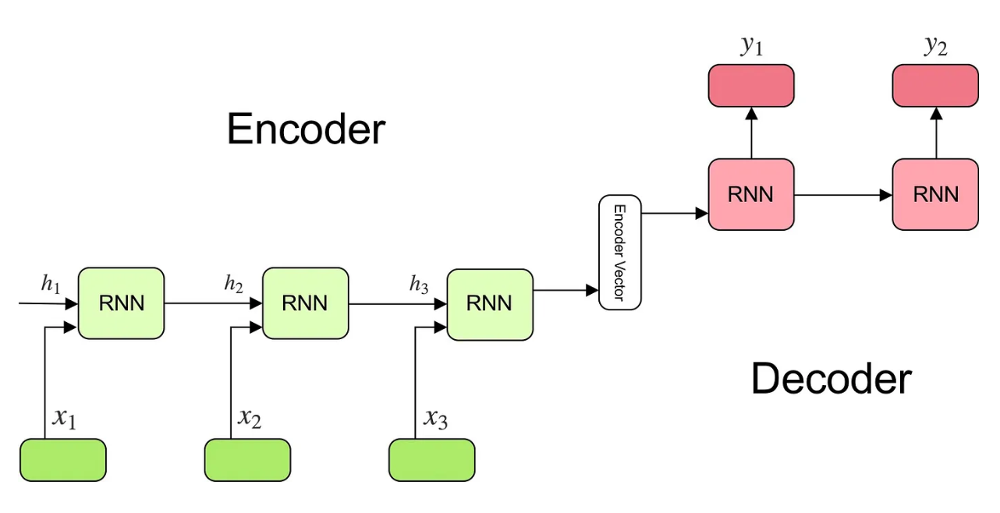
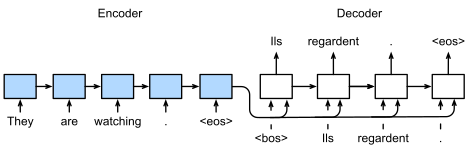
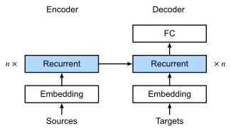
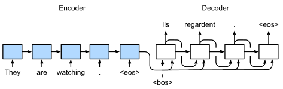

# Machine Translation, Encoder-Decoder Models, and Seq2Seq Architectures

## Ref: 
- [LSTM Tutorial](https://colah.github.io/posts/2015-08-Understanding-LSTMs/)
- [D2l Chapters 10.5, 10.6 and 10.7](https://www.d2l.ai/chapter_recurrent-modern/seq2seq.html)
  
## Machine Translation

- Machine translation converts text from one language to another using deep learning models.
- Common architectures include recurrent neural networks (RNNs) and transformers.
- Large parallel datasets (sentence pairs in source and target languages) are required for training.

### Datasets: WMT and IWSLT
- **WMT (Workshop on Machine Translation)**: Used for high-resource language pairs.
- **IWSLT (International Workshop on Spoken Language Translation)**: Used for speech-to-text translation.

#### Preprocessing Steps
- **Tokenization**: Splitting text into words/subwords.
- **Normalization**: Lowercasing, removing punctuation, etc.
- **Padding/Truncation**: Ensuring fixed sequence lengths.
- **Vocabulary Construction**: Using techniques like Byte Pair Encoding (BPE) or WordPiece.

---

## Encoder-Decoder Architecture

- Handles variable-length input and output sequences.
- Improves learning over long sequences compared to standard RNNs.
- Enables translation and other sequence-based tasks.

### Model Structure

#### **1. Encoder**
- Processes the input sequence into a fixed-length representation (context vector).
- Common implementations:
  - **GRU (Gated Recurrent Unit)**: Efficient with fewer parameters.
  - **LSTM (Long Short-Term Memory)**: Handles long-range dependencies well.

#### **2. Decoder**
- Uses the context vector from the encoder to generate the target sequence.
- Works autoregressively, generating one token at a time.
- Can be implemented using GRUs or LSTMs.

#### **3. Training Process**
- **Teacher Forcing**: Uses correct previous outputs during training instead of predicted outputs to improve learning.
- **Loss Function**: Cross-entropy loss (ignores padding tokens).
- **Evaluation Metric**: BLEU score (measures translation quality based on n-gram overlap).

---

## Sequence-to-Sequence (Seq2Seq) Model

### Architecture Overview
1. **Encoder**:
   - Processes input sequences into a context vector.
   - Uses RNN, GRU, or LSTM.

2. **Decoder**:
   - Generates output sequence token by token.
   - Starts with a special Start-of-Sequence (SOS) token.
   - Uses the encoder's final hidden state as context.

**Predicting the output sequence token by token using an RNN encoder–decoder:**

### Handling Long Sentences
- **Problem**: Fixed-length context vectors struggle with long inputs.
- **Solution**: Use Attention Mechanisms.

### Implementation Considerations
- Input and output sequences must be correctly dimensioned.
- **Padding** helps batch processing, but loss masking prevents learning from padding tokens.
- **Optimizers** like Adam or RMSProp improve training.
- **Scheduled Sampling** gradually reduces reliance on teacher forcing.

