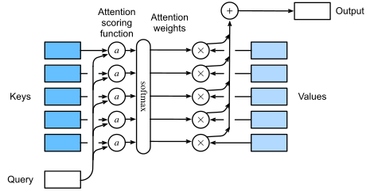

# Attention Mechanisms

Attention mechanisms enable models to focus on the most relevant parts of input sequences when making predictions. Originally developed for machine translation, attention is now a foundational component in many deep learning architectures, particularly transformers.

## Attention Pooling

Attention pooling is the core concept behind attention mechanisms. It works through these steps:

1. **Query (Q), Key (K), and Value (V) interaction**: 
   - Query: What we're looking for (our search term)
   - Keys: Labels for each item in our memory/context
   - Values: The actual information we want to extract

2. **Attention Calculation Process**:
   - Compute similarity between Q and each K to get attention scores
   - Convert scores to probabilities using softmax (creates attention weights)
   - Create a weighted sum of the values (V) using these weights

This process allows the model to focus on the most relevant parts of the input when making predictions, effectively "paying attention" to what matters most.

## Bahdanau (Additive) Attention

Bahdanau attention, introduced in 2014 for neural machine translation, uses a feedforward neural network for score calculation:

1. **Structure**: Uses learned linear transformations and a non-linearity to compute attention scores
   - Projects Q and K to a common space using learned weights
   - Combines them with addition
   - Applies a non-linearity (tanh)
   - Projects to a scalar score using another learned weight

2. **Key Advantages**:
   - More expressive than simple dot-product attention due to the non-linearity
   - Can learn more complex relationships between queries and keys
   - Particularly effective when dimensions of queries and keys differ

3. **Trade-offs**:
   - More computationally expensive than dot-product attention
   - Introduces more parameters to learn

## Multi-Head Attention

Multi-head attention allows the model to jointly attend to information from different representation subspaces:

1. **Concept**: Split attention into multiple parallel "heads" that each focus on different aspects of the input

2. **Process**:
   - Split Q, K, V into multiple heads (portions)
   - Calculate attention separately for each head
   - Concatenate the results
   - Apply a final linear projection

3. **Benefits**:
   - Allows the model to capture different types of relationships simultaneously
   - Each head can specialize in different patterns
   - Improves the expressive power of attention mechanisms

## Key Takeaways

- Attention mechanisms allow models to focus on the most relevant parts of input
- Attention pooling creates a weighted sum of values based on query-key similarity
- Bahdanau attention adds expressiveness through a learned scoring function
- Multi-head attention enables models to simultaneously focus on different aspects of the input
- Scaling improves dot-product attention by preventing softmax from saturating

## Code Examples

For code implementations of these attention mechanisms, refer to the Colab notebook: [Attention Mechanisms Notebook](https://colab.research.google.com/drive/1C7bqg5QEbn5oxwo53GcIew3nEGuRh0jM?usp=sharing)

## References

- Dive into Deep Learning, Chapter 11.1-11.6: [Attention Mechanisms](https://d2l.ai/chapter_attention-mechanisms-and-transformers/index.html)
- Bahdanau, D., Cho, K., & Bengio, Y. (2014). Neural machine translation by jointly learning to align and translate. arXiv preprint arXiv:1409.0473.
- Ashish, V. (2017). Attention is all you need. Advances in neural information processing systems, 30, I.
