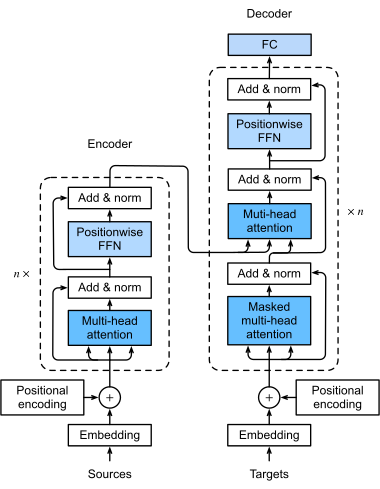

# Transformers and Attention Mechanisms  

## Ref:
- [The Illustrated Transformer (jalammar)](https://jalammar.github.io/illustrated-transformer/)
- [Transformers Blog](https://peterbloem.nl/blog/transformers)  
- [D2L: Self-Attention & Positional Encoding](https://d2l.ai/chapter_attention-mechanisms-and-transformers/self-attention-and-positional-encoding.html)  
- [D2L: Transformer](https://d2l.ai/chapter_attention-mechanisms-and-transformers/transformer.html)  
- **Example Code Notebook**: [Colab Link](https://colab.research.google.com/drive/18lNmQGRLCAekSzqBN9uFNZ0ft6nXARld?usp=sharing)

---

## Recall

### Standard Attention  

Attention allows a query vector to find relevant information in a set of key-value pairs.

$$
\text{Attention}(q, K, V) = \text{softmax}\left(\frac{qK^\top}{\sqrt{d_k}}\right) V
$$

- **q**: query  
- **K**: keys  
- **V**: values  
- Returns a context vector for **q**  

### Multi-Head Attention  
To improve expressiveness, we can use multiple attention heads:

$$
\text{MultiHead}(Q, K, V) = \text{Concat}(\text{head}_1, \ldots, \text{head}_h) W^O
$$

- Each head looks at the same inputs, but captures different patterns or relationships.

---

## Self-Attention  
In **self-attention**, every token in the sequence is both a **query** and part of the **key/value** set.

$$
Q = K = V = XW
$$

- $X$: input sequence (embeddings)  
- Each token attends to every other token, including itself  
- Output: contextualized representations for each token  

---

## Summary: Types of Attention

| Type           | Query Source | Key/Value Source | Use Case                          |
|----------------|--------------|------------------|-----------------------------------|
| Standard       | Decoder step | Encoder outputs  | Seq2Seq (e.g., translation)       |
| Multi-Head     | Multiple Qs  | Multiple KVs     | Richer representations            |
| Self-Attention | Input tokens | Same tokens      | Whole sequence (parallelized)     |


---

## Positional Encoding (PE)  

- Self-attention alone doesn't capture word order
- It's permutation invariant
- PE injects order information into the embeddings

**Two common methods:**  
- Fixed (sinusoidal) PE  
- Learned PE  

Example in the [Colab notebook](https://colab.research.google.com/drive/18lNmQGRLCAekSzqBN9uFNZ0ft6nXARld?usp=sharing)

---

## Transformer Architecture

### Encoder Block
1. Input + Positional Encoding  
2. Multi-head self-attention  
3. Add & LayerNorm  
4. Feed-forward  
5. Add & LayerNorm  

### Decoder Block
1. Masked multi-head self-attention  
2. Encoder-decoder attention  
3. Feed-forward  
4. Add & LayerNorm  


---

## Transformer Flow  
```
Input Sequence
      ↓
[Encoder Blocks]
      ↓
Encoded Representations
      ↓
[Decoder Blocks] ← Target Sequence
      ↓
Predictions
```

---

## Try This
Using the [D2L Colab notebook](https://colab.research.google.com/drive/18lNmQGRLCAekSzqBN9uFNZ0ft6nXARld?usp=sharing):

- Modify the number of encoder blocks  
- Visualize attention heatmaps  
- Try inputting a new sentence — observe token interactions  
- Bonus: Compare fixed PE vs. learned PE
