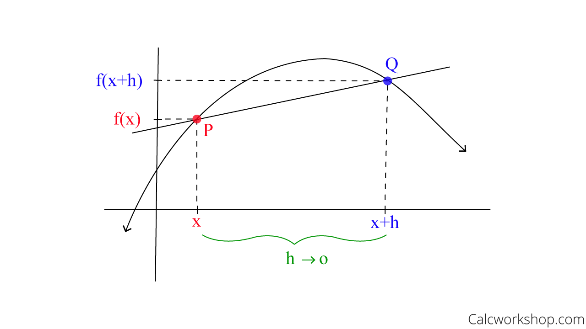

# Derivatives and Backpropagation in Deep Learning

## Learning Objectives:

- Understand the concept of derivatives and their role in optimization and neural networks.
- Learn to compute derivatives programmatically using automatic differentiation.
- Visualize derivatives and their application in a simple gradient descent example.
- Understand the concept and the steps of backpropagation.

## Derivatives and Gradients

**Derivative**: Rate of change of a function with respect to an input (i.e., slope of a function at any point).

*Example:*

- The slope of a constant value (like 5) is always 0.
- The slope of a line like `2x` is `2`.
- The slope of `x^2` is 2x.

*Visual:* Imagine a graph of a curved line representing a function, and at any point on that curve, the derivative is the slope of the tangent line drawn at that point; essentially showing how quickly the function is changing at that specific point, with steeper slopes indicating a faster rate of change. 

A **partial derivative** is just a derivative, but for a function with multiple variables. Instead of looking at the rate of change with respect to all variables, you focus on just one variable at a time while treating the others as constants.

**Gradients** are the generalization of derivatives for multivariable functions (i.e., a vector that represents the rate of change of a function in multiple variables at a given point, i.e. a vector containing all the partial derivatives of a function). For example, in a function `f(x, y) = x^2 + y^2`, the gradient of `f` is `[2x, 2y]`, which is a vector that tells you the direction of the steepest increase in the function at any point `(x, y)`.

## Derivatives in Deep Learning

- Loss minimization via gradient descent.
- **Backpropagation**: Computing gradients layer-by-layer.

## Challenges Without Automation

- Manual computation is tedious for complex functions.
- Solution: Automatic differentiation libraries (e.g., PyTorch, TensorFlow).

# Backpropagation

**Backpropagation**  is an algorithm for training neural networks by optimizing their weights and biases. It works by propagating the error backward through the network and updating parameters to minimize the loss function.

The goal of training a neural network is to minimize the **loss function** (a measure of the difference between predictions and actual values) by adjusting the weights and biases. Backpropagation computes the gradients of the loss function with respect to the weights and biases efficiently, using the **chain rule** from calculus.

## Steps of Backpropagation

### Step 1: Forward Propagation

- Input data is passed through the network, layer by layer, to compute the **predicted output**.
- At each layer, the activation function processes the weighted sum of inputs.
- The **loss** (error) is calculated by comparing the predicted output with the actual target value.

### Step 2: Compute Gradients (Backward Pass)

- Backpropagation calculates how much each weight and bias in the network contributed to the loss.
- Using the **chain rule**, gradients are propagated backward from the output layer to the input layer.

This involves:
1. Output Layer: Compute the error at the output layer.
2. Hidden Layers: Propagate the error backward through each hidden layer.

### Step 3: Update Weights and Biases

Using the gradients, update the weights and biases to minimize the loss, where the learning rate controls the step size during optimization.

## Chain Rule Intuition

The **chain rule** is used to compute the derivative of a composite function, such as `f(g(x))`. Intuitively, it allows us to break down the derivative of a complex function into the product of simpler derivatives. In the context of backpropagation, it helps us understand how changes in the weights and biases of each layer affect the overall loss, enabling us to efficiently compute gradients layer by layer.
