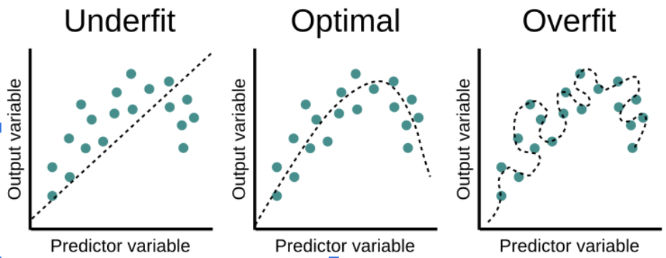

# Softmax Regression and Cross-Entropy Loss

## Understanding the Softmax Function

Softmax is a function that converts raw scores (logits) into probabilities, making them interpretable for classification tasks. Given a vector of logits , softmax is defined as:

_j%20%3D%20\frac{e^{z_j}}{\sum_k%20e^{z_k}})

where:

-  is the raw score (logit) for class .
-  is **Euler’s number** (~2.718), the base of the natural logarithm.
- The denominator ensures all probabilities sum to **1**, making it a valid probability distribution.

### Why Use Exponentiation and Normalization?

- **Exponentiation ensures positive values** (which are required for probabilities).
- **Normalization (division by sum)** ensures that the output probabilities sum to **1**, which is necessary for classification.

## Example Calculation of Softmax

Consider a **three-class classification problem** where the logits (raw scores) are:

![\mathbf{z} = [2.0, 1.2, -0.5]](https://latex.codecogs.com/png.latex?\mathbf{z}%20%3D%20%5B2.0%2C%201.2%2C%20-0.5%5D)

### Step 1: Compute the exponentials

### Step 2: Sum the exponentials

### Step 3: Normalize

%20%3D%207.389%20%2F%2011.315%20%5Capprox%200.653)
%20%3D%203.320%2F11.315%20\approx%200.293)
%20%3D%200.606%2F11.315%20\approx%200.054)

Thus, the **softmax output** is:

\[ [0.653, 0.293, 0.054] \]

✅ The sum of probabilities is **1**, confirming that it is a valid probability distribution.

## Cross-Entropy Loss: Measuring Model Performance

Once we have softmax probabilities, we need a way to measure how well our model is performing. This is where **cross-entropy loss** comes in.

### Definition of Cross-Entropy Loss

For a given data point, if the true class is represented as a one-hot encoded vector , and the predicted probabilities are , the loss is computed as:

)

where:

-  is **1** for the correct class and **0** for all others.
-  is the predicted probability for that class.
- The **log function** is used because:
  - It **penalizes incorrect confident predictions** heavily.
  - It **reduces loss when the correct class has high probability**.

> Cross-entropy measures the difference between two probability distributions:  
> (1) the true distribution (often one-hot), and  
> (2) the model’s predicted distribution.  
> For further details, see [the d2l.ai chapter on softmax regression](https://d2l.ai/chapter_linear-classification/softmax-regression.html).

### Example Calculation of Cross-Entropy Loss

Assume the true label is **class 1** (one-hot encoded as \([1,0,0]\)), and the predicted probabilities are:

\[ \hat{\mathbf{y}} = [0.653, 0.293, 0.054] \]

Plugging into the formula:

%20+%200%20\times%20\log(0.293)%20+%200%20\times%20\log(0.054)))
%20\approx%20-(-0.425)%20%3D%200.425)

### Interpreting Loss Values

- If the model predicts **100% confidence on the correct class**, \( L = 0 \) (perfect prediction).
- If the model is **50-50 unsure**, \( L \approx 0.69 \) (uncertain).
- If the model is **completely wrong**, \( L \gg 1 \) (high penalty).

## Visualization: Exploring Logits & Probabilities

To explore softmax behavior, you can create play around with an [interactive widget Colab notebook](https://colab.research.google.com/drive/1kPQn44LTi9T9HcXzDWfWMxgaqdT72HoR?usp=sharing), where you adjust logits and observe changes in output probabilities.

## Takeaways

- **Softmax converts logits into probabilities** to make predictions interpretable.  
- **Exponentiation and normalization** ensure that predictions are valid probabilities.  
- **Cross-entropy loss penalizes incorrect predictions** and encourages confident, correct outputs.  

# Generalization

A model that generalizes well should perform well on unseen data, not just the training data.

- Underfitting: Model is too simple, failing to capture patterns.
- Good Fit: Model generalizes well.
- Overfitting: Model memorizes noise and lacks generalization.

## Regularization (Weight Decay)

Regularization helps prevent overfitting by penalizing large weights.

In Softmax Regression, we use L2 Regularization (weight Decay), modifying the loss function:

%20%2B%20%5Clambda%20%5Csum%20w%5E2)

- First term: Ensures correct predictions using Cross-Entropy Loss.
- Second term: L2 penalty (sum of squared weights) discourages large weights, preventing overfitting.

L2 Regularization:
- Reduces model complexity: prevents excessive reliance on a few features.
- Encourages smaller weights: smoother decision boundaries.
- Acts like noise injection: forces model to be robust to small variations.

| Regularization Method | How It Works |
|----------------------|--------------|
| L2 Regularization (Weight Decay) | Adds penalty term `λΣw²` to loss function, encouraging smaller weights and smoother decision boundaries |
| Data Augmentation | Creates new training samples by applying transformations like rotations, flips, and noise to existing data |
| Dropout | Randomly drops neurons during training with probability p, reducing co-adaptation and improving generalization |

