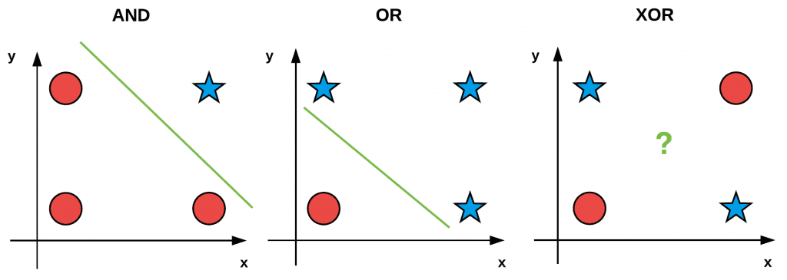

# Multilayer Perceptrons (MLPs)

## Introduction: Why Go Beyond Linear Models?

### The Limitation of Linear Models
- Linear models can only learn **linearly separable functions**.
- **Example: XOR problem**: A single line **cannot** separate the points correctly.

| Input 1 | Input 2 | Output |
|---------|---------|--------|
| 0       | 0       | 0      |
| 0       | 1       | 1      |
| 1       | 0       | 1      |
| 1       | 1       | 0      |


- Adding a **hidden layer** introduces non-linearity, enabling the model to learn more complex patterns.

## Universal Approximation Theorem

- An **MLP with a single hidden layer** and enough neurons can approximate **any continuous function**.
- However, **deep networks** are more efficient at learning complex functions than wide shallow networks.
- This motivates the use of **deep learning architectures**.

### Why Use Deep Networks Instead of a Single Hidden Layer?
1. **Parameter Efficiency**  
   - Shallow networks require exponentially more neurons to approximate certain functions.
   - Deep networks **reuse features**, making them more efficient.

2. **Hierarchical Feature Learning**  
   - Lower layers learn **basic features** (e.g., edges in an image).
   - Higher layers learn **complex patterns** (e.g., eyes, faces).

**Conceptual Example:**
Consider a *shallow network* with one hidden layer:

- Input: A 100 x 100 image (10,000 pixels).
- Hidden Layer: 1,000 neurons.
- Weights: Each neuron connects to all pixels -> 10M weights.

Now, consider a *deep network*:

- Layer 1: Detects edges → 100 neurons (connected to only a small region of the image).
- Layer 2: Detects shapes using outputs from Layer 1 -> 500 neurons.
- Layer 3: Detects complex objects (digits) using Layer 2 -> 1,000 neurons.

Deep networks share and reuse smaller patterns, reducing parameters from 10M to ~200K, making training faster and more memory-efficient.

### Simple Example: How a Deep Network Processes an Input Step by Step

**Step 1: Input Representation**
We use a **small 4x4 grayscale image** representing the digit **"7"**. Each pixel is either **0 (black)** or **1 (white)**:

$$
X =
\begin{bmatrix}
0 & 0 & 1 & 1 \\
0 & 1 & 1 & 0 \\
0 & 0 & 1 & 0 \\
0 & 0 & 1 & 0
\end{bmatrix}
$$

This **matrix \(X\) is our input** to the neural network.

**Step 2: First Hidden Layer - Detecting Edges**
The **first layer** learns simple features, like detecting **horizontal and vertical edges**. Assume we have a **weight matrix \(W_1\)** that applies an **edge detection filter**:

$$
H_1 = W_1 \cdot X
$$

Resulting in:

$$
H_1 =
\begin{bmatrix}
0 & 0 & 2 & 2 \\
0 & 2 & 2 & 0 \\
0 & 0 & 2 & 0 \\
0 & 0 & 2 & 0
\end{bmatrix}
$$

**Interpretation:** This layer detects **vertical edges** in the digit "7".

**Step 3: Second Hidden Layer - Detecting Simple Shapes**
The **second layer** combines these edges into **basic shapes**, such as corners or diagonal lines. It applies another transformation:

$$
H_2 = W_2 \cdot H_1
$$

Resulting in:

$$
H_2 =
\begin{bmatrix}
2 & 2 & -2 & -2 \\
2 & -2 & -2 & 2 \\
2 & 2 & -2 & 2 \\
2 & 2 & -2 & 2
\end{bmatrix}
$$

**Interpretation:** This layer highlights the **corners of the "7"**, helping the network understand the shape.

# Activation Functions: Introducing Non-Linearity

## Why Use Activation Functions?
- Without an activation function, an MLP **reduces to a linear model**.
- Activation functions allow networks to **capture non-linear relationships**.

### Common Activation Functions:

#### **ReLU (Rectified Linear Unit)**
- Outputs the input if positive, otherwise zero.
- Fast and helps mitigate vanishing gradients.

#### **Sigmoid**
- Maps input to a range between 0 and 1.
- Useful for probabilities but suffers from **vanishing gradients**.

#### **Tanh**
- Maps input to a range between -1 and 1.
- Centered around zero but still prone to vanishing gradients.

# Forward Propagation in MLPs

### **Computational Flow**
1. Input is passed through **weights and biases**.
2. Activation function introduces **non-linearity**.
3. The output layer generates **predictions**.

### **Steps in Forward Pass**
1. Compute **hidden layer activations** using input weights and biases.
2. Apply an **activation function** to the hidden layer.
3. Compute **output layer activations** using output weights and biases.

# Backpropagation: How MLPs Learn

### **Why Do We Need Backpropagation?**
- Backpropagation calculates the **gradient of the loss function** with respect to each weight.
- Uses **the chain rule** to propagate gradients backward through the network.

### **Steps of Backpropagation**
1. **Compute Forward Pass:** Calculate network outputs.
2. **Compute Loss:** Compare output to the true label (e.g., using cross-entropy).
3. **Compute Gradients:** Differentiate loss w.r.t. parameters.
4. **Update Parameters:** Use **gradient descent** to adjust weights.

# Implementing an MLP: Key Steps

### **Steps to Build an MLP**
1. **Define Model Architecture**
   - Choose **input layer size, number of hidden layers, and output layer size**.
   - Select an **activation function** (e.g., ReLU, Sigmoid).

2. **Initialize Weights and Biases**
   - Use proper **weight initialization techniques** to prevent vanishing/exploding gradients.

3. **Forward Pass**
   - Compute activations for **hidden and output layers**.

4. **Compute Loss**
   - Compare predicted and actual values using **cross-entropy loss**.

5. **Backward Pass (Backpropagation)**
   - Compute gradients of the loss function w.r.t. weights and biases.

6. **Update Weights**
   - Apply **gradient descent** (or another optimizer) to update parameters.

# Training an MLP on a Dataset

### **Steps to Train an MLP**
1. **Load and Preprocess Dataset**
   - Convert data into **numerical format**.
   - Normalize features to ensure proper training.

2. **Split Data into Training and Test Sets**
   - Helps in evaluating model performance on unseen data.

3. **Set Training Parameters**
   - Define **learning rate, number of epochs, batch size**.

4. **Train Model**
   - Perform **forward pass, compute loss, backpropagate gradients, update weights**.

5. **Evaluate Model Performance**
   - Measure accuracy on **test data**.
   - Adjust **hyperparameters** if necessary.

# Why Deep Networks? 

### **Deep vs. Shallow Networks**
| Network Type | Pros | Cons |
|-------------|------|------|
| **Shallow** | Easier to train, requires fewer computations | Needs many neurons for complex tasks |
| **Deep** | Efficient parameter usage, learns hierarchical features | Harder to train, prone to vanishing gradients |

### **How to Improve Deep Networks?**
- **Batch Normalization:** Stabilizes activations.
- **Dropout:** Reduces overfitting by randomly deactivating neurons.
- **Weight Initialization:** Using **Xavier or He initialization** prevents gradients from exploding or vanishing.

## ✅ Key Takeaways
- **MLPs solve problems that linear models cannot** (e.g., XOR problem).
- **Universal Approximation Theorem:** A **single hidden layer** can approximate any function, but deep networks are more efficient.
- **Activation functions (ReLU, Sigmoid, Tanh) introduce non-linearity**.
- **Backpropagation computes gradients** to update weights.
- **Deep networks learn hierarchical features**, making them useful for complex tasks.

# 🧠 Vanishing & Exploding Gradients, Dropout, and Weight Initialization

## 1️⃣ Vanishing & Exploding Gradients  
- **Vanishing Gradients**: Gradients become very small, causing early layers to learn **slowly**.  
- **Exploding Gradients**: Gradients become too large, making learning **unstable**.  
- **Cause**: Happens when using **sigmoid/tanh** activations or **poor weight initialization**.  

## 2️⃣ Weight Initialization 
Proper initialization helps prevent vanishing/exploding gradients.  

### **Common Strategies:**
1. **Xavier (Glorot) Initialization**:  
- Used for **sigmoid/tanh** activations.  
- Keeps activation variance consistent.  
- Formula (where W is weight matrix, U is uniform distribution, n_in is number of input neurons, n_out is number of output neurons):  
   
$$
W \sim U \left( -\frac{\sqrt{6}}{\sqrt{n_{\text{in}} + n_{\text{out}}}}, \frac{\sqrt{6}}{\sqrt{n_{\text{in}} + n_{\text{out}}}} \right)
$$

2. **He Initialization**:  
- Used for **ReLU** activations.  
- Accounts for **inactive ReLU neurons**.  
- Formula (where W is weight matrix, N is normal distribution, n_in is number of input neurons):  

$$
W \sim \mathcal{N} \left( 0, \frac{2}{n_{\text{in}}} \right)
$$

**Implementation in PyTorch:**
```python
import torch.nn.init as init

# Xavier Initialization
layer = torch.nn.Linear(100, 50)
init.xavier_uniform_(layer.weight)

# He Initialization
layer = torch.nn.Linear(100, 50)
init.kaiming_normal_(layer.weight)
```

**Try it Out!** [Weight Initialization Experiment](https://colab.research.google.com/drive/1UDRWi7bPA-fG97Mlrk2BtuNXPBsgVEmX?usp=sharing)
- Test how different weight initializations affect activations in a simple 3-layer network.

## 3️⃣ Dropout: Preventing Overfitting

Overfitting happens when a model memorizes training data instead of generalizing.
Dropout randomly disables neurons to prevent reliance on specific pathways.

- **PyTorch Dropout Example:**

```python
import torch.nn as nn

dropout = nn.Dropout(p=0.5)  # 50% dropout rate
```

**Try it out!** [Dropout Experiment](https://colab.research.google.com/drive/1nhKBr0oJKpDBZVAC_xeV1-8LtNQVPMaa?usp=sharing)
- Modify the dropout rate (0.0, 0.2, 0.5, 0.8) and observe training performance.
- Replace dropout with Batch Normalization and compare results.

## ✅ Key Takeaways
- **Vanishing/Exploding Gradients**: Occurs when gradients shrink or grow too much.
- **Weight Initialization Matters**: Xavier (sigmoid/tanh), He (ReLU) help prevent issues.
- **Dropout**: Reduces overfitting by randomly disabling neurons during training.