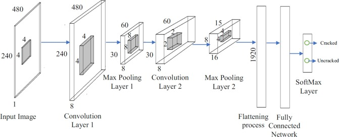

# **Convolutions**  

## Convolution Neural Networks
- **CNNs automate feature extraction**, removing the need for manual selection.
- CNNs consist of **convolutional layers, pooling layers, and fully connected layers**.



- Max pooling reduces the size of the feature maps while keeping the most important information.
- CNNs process images by **learning** to extract patterns using convolutional layers. The convolution layer is responsible for detecting patterns in an image, such as edges, textures, and shapes.
- Convolutions apply **filters** to images, detecting patterns like edges, textures, and shapes.
- Convolutions involve a **small filter sliding over an image**, performing matrix multiplications.
- Two important parameters:  
  - **Stride:** Controls how far the filter moves each step. Larger strides reduce resolution.
  - **Dilation:** Adds gaps between filter elements to capture larger structures.
- Filters help CNNs identify important features automatically, reducing the need for manual feature extraction.

## Activity 10 Example: Edge Detection with Convolution

[Activity 10 Supplemental Code](https://colab.research.google.com/drive/1a_E3aRfyROo1qwlPvLrqMDDRI7B65Og1?usp=sharing)

The original 5×5 image grid:
```
  0     0    255    0     0  
  0    255   255   255    0  
255   255   255   255   255  
  0     0    255    0     0  
  0     0    255    0     0  
```

Filter:
```
  -1   -1   -1  
  -1    8   -1  
  -1   -1   -1  
```

Since we apply a 3×3 filter, we slide it over valid positions where the filter fully fits within the 5×5 image. This results in a 3×3 output grid, which corresponds to the central region of the image.
Each number in the 3×3 output represents the result of applying the 3×3 edge detection filter at each of these positions.

### Step-by-Step Sliding Window

The sliding window moves left-to-right across each row, then moves downward. See [visualization](https://ezyang.github.io/convolution-visualizer/) of this process. The filter calculations at each step are:

Position (1,1):
```
  0     0   255  
  0   255   255  
255   255   255  
```

Applying the filter:
```
(0 × -1) + (0 × -1) + (255 × -1)  
(0 × -1) + (255 × 8) + (255 × -1)  
(255 × -1) + (255 × -1) + (255 × -1)  
= 0 + 0 - 255  
+ 0 + 2040 - 255  
- 255 - 255 - 255  
= 2040 - 1275 = 765 (Capped at 255)  
```
Output: 255

Other positions follow the similar process.

Final 3×3 Output Grid:
```
255   255   255  
255   255   255  
  0    255    0  
```

### Output Interpretation

- The high 255 values indicate strong edges where the grayscale intensity changes sharply.
- The 0 values correspond to areas where pixel intensities are relatively uniform, meaning no strong edges were detected.
- The resulting 3×3 grid highlights the edges of the tree structure from the original image, effectively emphasizing its boundaries.

### Filter Application & Valid Positions:

The 3×3 filter is centered over different parts of the 5×5 input, but it can't be applied to areas where it would extend beyond the image boundary.
Since the filter moves from left to right and top to bottom, the only positions where it fits entirely result in a 3×3 valid region.

Each Pixel in the Output Represents an Edge Response:
Each output value represents how strongly an edge is detected in the region covered by the filter at that moment.

Strong edges (high contrast changes) give high values (255), while smooth regions give low values (0).

This process mimics how convolutional neural networks (CNNs) detect edges in image processing tasks.

### **Interactive CNN Visualization**

[CNN Visualizer](https://adamharley.com/nn_vis/cnn/2d.html)

1. **Observe the first layer**: Simple edge detection.
2. **Move deeper** into the CNN: Shapes and textures emerge.
3. **Final layers**: Full objects are recognized.

Another Visualizer: [CNN Explainer](https://poloclub.github.io/cnn-explainer/)